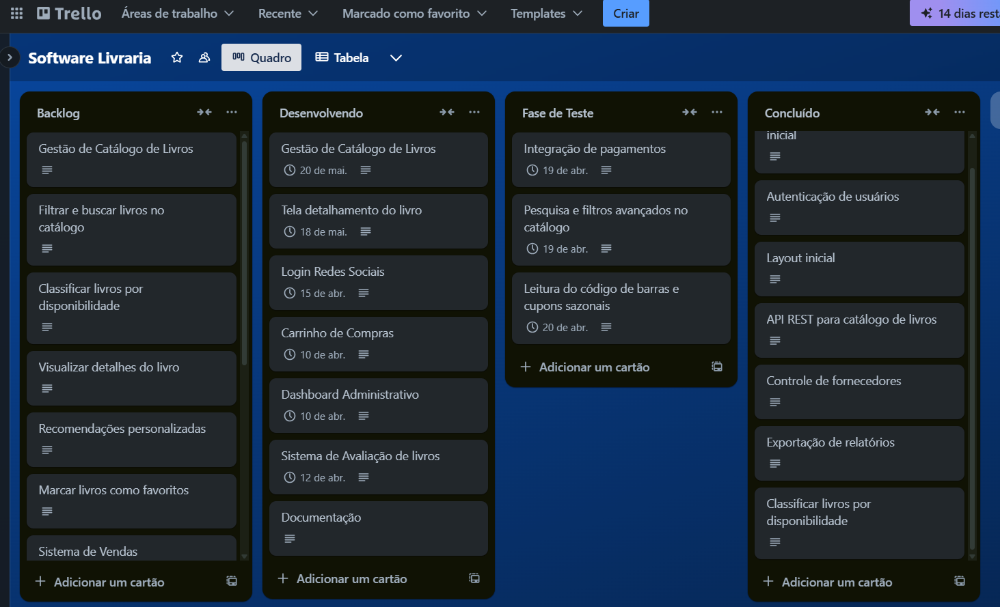

# projeto-software-agile

# Projeto de Software - Gestão Acadêmica e Metodologias Ágeis

Este repositório contém o projeto prático desenvolvido durante o 3º semestre da graduação em Gestão da Tecnologia da Informação. O foco principal foi a aplicação de metodologias ágeis no ciclo de vida de desenvolvimento de um software.

## 🚀 Sobre o Projeto
O trabalho simula um cenário real de mercado onde atuei em duas frentes:
1. **Papel do Cliente:** Definição de requisitos e visão do produto para um aplicativo de catálogo e vendas de livros.
2. **Papel do Product Owner (PO):** Elaboração do Product Backlog, priorização de funcionalidades por valor de negócio e organização do fluxo de trabalho.

## 🛠️ Metodologias e Ferramentas Utilizadas
* **Metodologia Ágil:** Scrum e Kanban.
* **Gestão de Tarefas:** Trello (utilizado para simular o fluxo de sprints e entregas).
* **Documentação:** Estruturação de Backlog, levantamento de requisitos e critérios de aceitação.

## 📊 Quadro Kanban (Fluxo de Trabalho)
Abaixo, a representação visual do gerenciamento das tarefas no Trello, demonstrando a divisão entre Backlog, Tarefas em Andamento e Concluídas:

  

## 📋 Resultados Alcançados
Através da aplicação prática, foram obtidos os seguintes resultados:
* **Estruturação do Backlog:** Criação de itens essenciais como Autenticação de Usuários, API para Catálogo de Livros, Integração de Pagamentos e Dashboard Administrativo.
* **Gestão de Prazos:** Definição de cronogramas com datas específicas (ex: Layout Inicial e Login via Redes Sociais) para garantir a cadência de entrega.
* **Fluxo de Trabalho Visual:** Implementação de um quadro Kanban permitindo a visibilidade total do status das tarefas (A fazer, Em andamento, Concluído).
* **Visão de Valor:** Priorização de funcionalidades que impactam diretamente a experiência do usuário, como filtros avançados e recomendações personalizadas.

## 🏁 Conclusão
O projeto demonstrou que o uso de metodologias ágeis é fundamental para a colaboração e o alinhamento das necessidades do cliente. A aplicação do Scrum e Kanban permitiu reduzir desperdícios, promover a melhoria contínua e garantir a excelência na qualidade do produto final.

---

## 📂 Conteúdo Adicional
O relatório acadêmico completo, com a fundamentação teórica e as conclusões, pode ser consultado na pasta `/docs`. [Visualizar Relatório Acadêmico](https://github.com/cezarscarvalho/projeto-software-agile/blob/main/docs/Portif%C3%B3lio%20-%20Projeto%20de%20Software-%20Terceiro%20Semestre.pdf)

## 🧭 Navegação Completa pelo Portfólio

Confira os meus outros projetos técnicos desenvolvidos durante a graduação em Gestão de TI:

* 🏠 [**Voltar ao Perfil Principal**](https://github.com/cezarscarvalho)
* 💻 [**Lógica de Programação** (Portugol)](https://github.com/cezarscarvalho/logica-programacao-portugol)
* 🐧 [**Sistemas Operacionais** (Linux & VirtualBox)](https://github.com/cezarscarvalho/sistemas-operacionais-linux)
* 📐 [**Lógica e Processos** (Fluxogramas)](https://github.com/cezarscarvalho/logica-fluxograma-processos)
* 🌐 [**Redes de Computadores** (Cisco Packet Tracer)](https://github.com/cezarscarvalho/redes-infraestrutura-corporativa)

## ✉️ Contato

